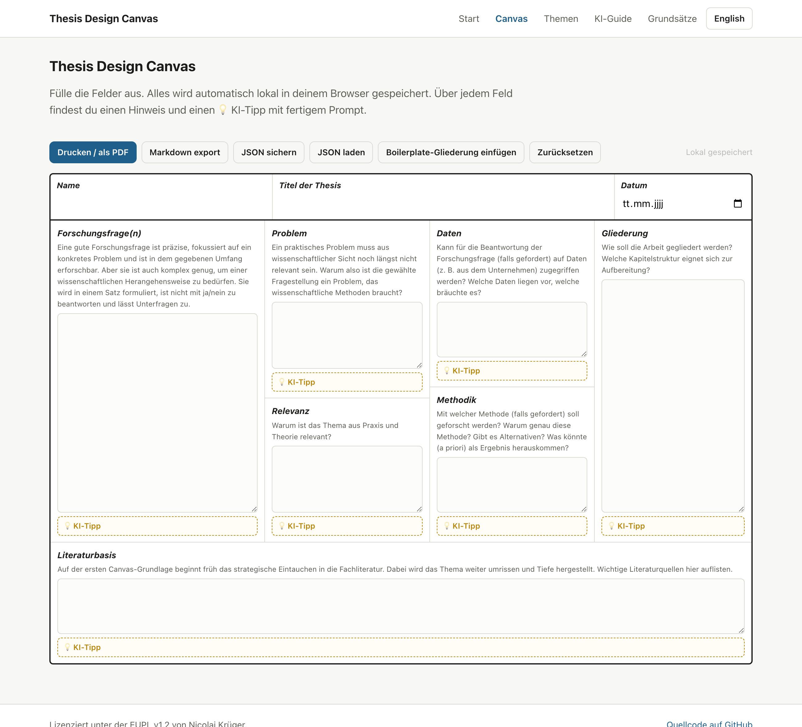

# Thesis Design Canvas

**➡️ Zur Anwendung: https://nicolaikrueger.github.io/thesis_canvas/**

Interaktive, zweisprachige Vorlage für die Themenfindung und Betreuung von Abschlussarbeiten bei Prof. Dr. Nicolai Krüger. Canvas, Themen, KI-Guide und der Ablauf der Betreuung — direkt im Browser, ohne Installation.

*Interactive, bilingual template for finding thesis topics and supervising theses with Prof. Dr. Nicolai Krüger. Open it in the browser, no installation.*

Lizenz / License: EUPL v1.2.
